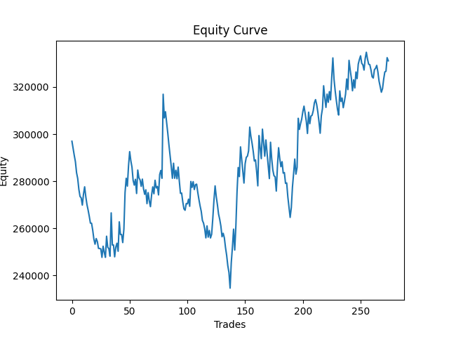
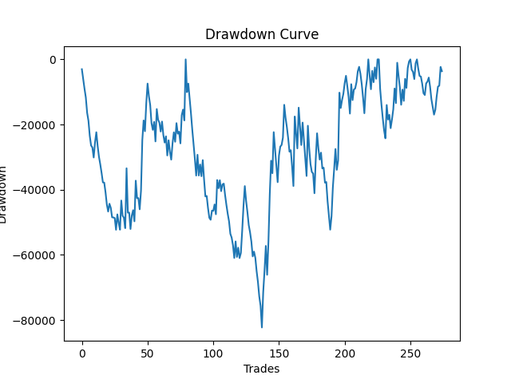
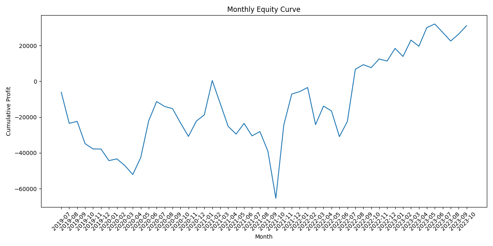

# ORB Backtesting Engine

A modular Python-based backtesting engine designed to simulate an **Opening Range Breakout (ORB)** strategy using large-scale historical market data.

This project focuses on **system architecture, scalable data handling, and performance optimization**, rather than just strategy logic.

---

# Project Objective

The goal of this project is to build a **professional-grade backtesting framework** capable of processing large datasets, executing trading simulations, and generating structured performance analytics.

Primary focus areas:

- Modular system architecture
- Config-driven execution
- Large-scale data processing
- Reusable analytical pipelines
- Deterministic simulation outputs

---

# Key Features

✔ Modular Python architecture  
✔ Config-driven strategy parameters  
✔ Multi-file historical data loader  
✔ Large dataset support (**1000+ files, ~14GB data**)  
✔ Signal caching for faster re-runs  
✔ Trade execution engine  
✔ Risk tracking (MAE / MFE)  
✔ PnL and equity curve generation  
✔ Monthly and performance analytics  
✔ Version-controlled development workflow  

---

# Data Handling Capabilities

One of the primary engineering challenges addressed in this project was efficient large-scale data handling.

System capabilities:

- Processes **3+ years of 1-minute market data**
- Handles **1000+ CSV files**
- Dataset size approximately **14 GB**
- Implements **data caching** to reduce repeated processing
- Supports fast re-execution during development cycles

Caching significantly reduces runtime during iterative testing.

---

# System Architecture

Project structure:
orb-backtester/
│
├── main.py
│
├── src/
│ ├── config.py
│ ├── data_loader.py
│ ├── signal_cache.py
│ ├── orb_strategy.py
│ ├── trend_filter.py
│ ├── atr_filter.py
│ ├── trade_engine.py
│ ├── pnl_engine.py
│ ├── equity_curve.py
│ ├── monthly_report.py
│ ├── monthly_plot.py
│ ├── performance_report.py
│
├── cache/
│
├── reports/
│
├── data/
│
├── requirements.txt
│
└── README.md

Each module follows a **single responsibility design**, improving maintainability and scalability.

------------

# Sample Output

Example outputs generated by the system:

## Equity Curve

## Drawdown Curve

## Monthly Equity Curve

-------

# Execution Pipeline

The system follows a deterministic execution flow:

1. Load historical data  
2. Generate ORB signals  
3. Apply trend filter  
4. Apply ORB range filter  
5. Execute trades  
6. Calculate trade PnL  
7. Generate equity curve  
8. Generate performance reports  
9. Save output artifacts  

---

# Core System Components

## Data Loader

Handles multi-file dataset ingestion.

Responsibilities:

- Load multiple CSV files
- Normalize column formats
- Create datetime index
- Filter required instruments
- Support caching for fast reloads

---

## Signal Engine

Generates ORB breakout signals.

Includes:

- Opening Range calculation
- Breakout detection
- Stop loss generation

---

## Filters

Additional validation logic applied before trade execution.

Includes:

- Trend Filter (EMA-based)
- ORB Range Filter
- Optional ATR Filter (configurable)

---

## Trade Engine

Simulates trade lifecycle.

Responsibilities:

- Entry validation
- Stop loss tracking
- Time-based exit handling
- MAE/MFE calculation
- Overlap prevention

---

## PnL Engine

Tracks financial performance.

Responsibilities:

- Trade PnL calculation
- Equity tracking
- Drawdown calculation

---

## Reporting Engine

Generates structured analytics outputs.

Includes:

- Trade-level logs
- Monthly summaries
- Performance statistics
- Visualization charts

---

# Output Artifacts

The system generates multiple structured outputs.

Examples:

- trades_with_pnl.csv  
- equity_curve.csv  
- equity_curve.png  
- drawdown_curve.png  
- monthly_pnl.csv  
- monthly_equity_curve.png  

These outputs enable performance analysis and visualization.

---

# Setup Instructions

## Step 1 — Create Virtual Environment
python -m venv .venv
## Step 2 — Activate Environment

Windows:
.venv\Scripts\activate

Linux / Mac:

source .venv/bin/activate

## Step 3 — Install Dependencies

pip install -r requirements.txt

---

# Running the System

Execute:

python main.py

The system will:

- Load data
- Execute simulation
- Generate reports
- Save outputs

---

# Design Principles

This project follows disciplined engineering practices:

✔ Modular architecture  
✔ Clean code separation  
✔ Config-driven logic  
✔ Reusable components  
✔ Minimal hardcoding  
✔ Deterministic execution  
✔ Version-controlled development  

---

# Version History

## v1.0 — Baseline System

Stable baseline version including:

- ORB breakout logic
- EMA-based trend filtering
- ORB range filtering
- Time-based exit logic
- Performance analytics
- Monthly reporting
- Equity and drawdown visualization

This version establishes the **reference performance baseline**.

---

# Planned Enhancements

Future development roadmap:

- Dynamic trailing exit module
- Risk-based position sizing
- Portfolio-level testing
- Strategy optimization tools
- Parallel data processing improvements

---

# Sample Output (Recommended)

Add example charts here after generating outputs.

Example:
reports/equity_curve.png
reports/drawdown_curve.png

---

# Technologies Used

Primary technologies:

- Python  
- Pandas  
- NumPy  
- Matplotlib  
- CSV Data Processing  

Supporting tools:

- Git  
- Virtual Environments  
- Modular Python Design  

---

# Learning Outcomes

This project strengthened understanding in:

- Large-scale data processing
- Modular Python development
- System design patterns
- Backtesting workflows
- Performance analytics pipelines
- Caching strategies
- Version-controlled development

---

# Disclaimer

This repository is intended for:

**Educational and system development purposes**

It demonstrates:

- Backtesting architecture
- Data engineering workflows
- Modular system design

Trading strategy logic is simplified for demonstration purposes.

---

# Author

Developed as part of a structured Python and system-building learning journey focused on real-world engineering practices.

# Sample Output

Example outputs generated by the system:

## Equity Curve

## Drawdown Curve

## Monthly Equity Curve

# Disclaimer

This repository is intended for educational and demonstration purposes only.

The focus of this project is on software engineering practices such as modular design, data processing, caching mechanisms, and performance analytics.

This system is not intended for live trading or financial decision-making.